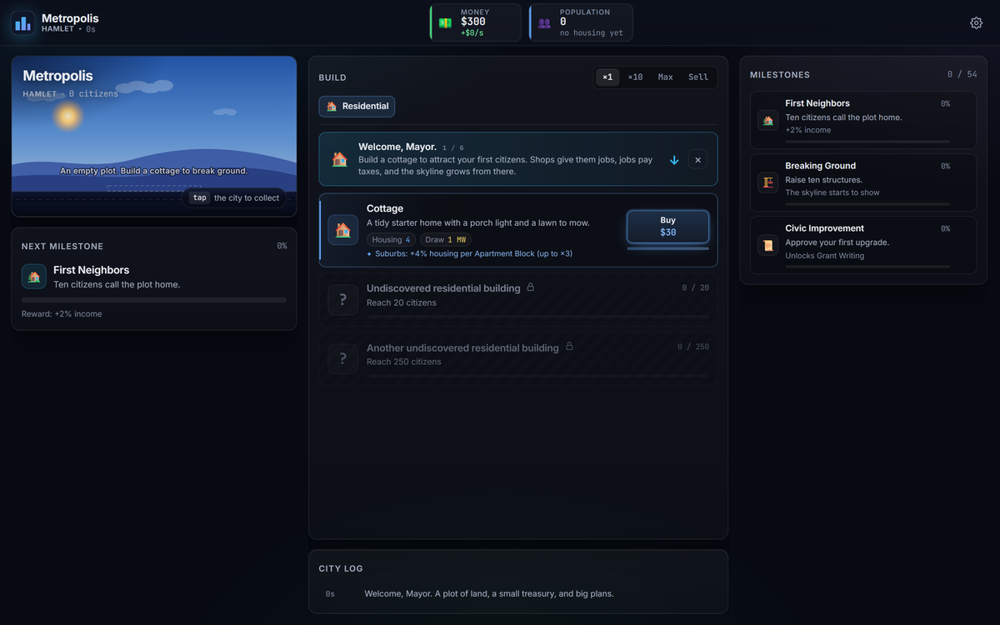
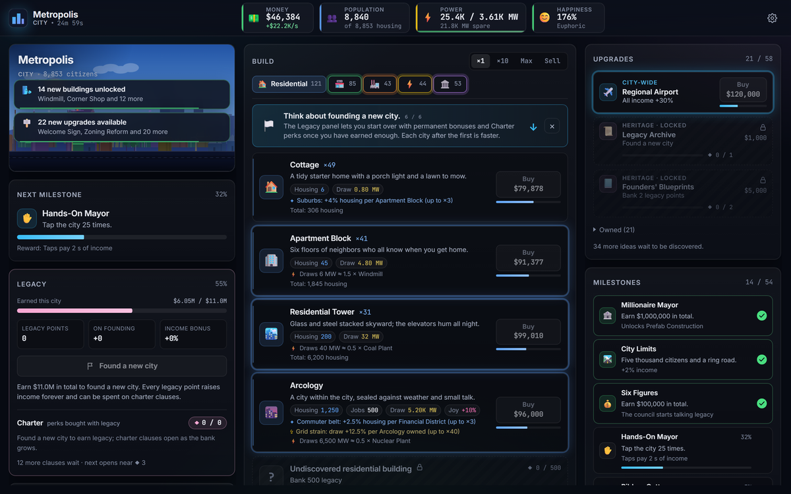
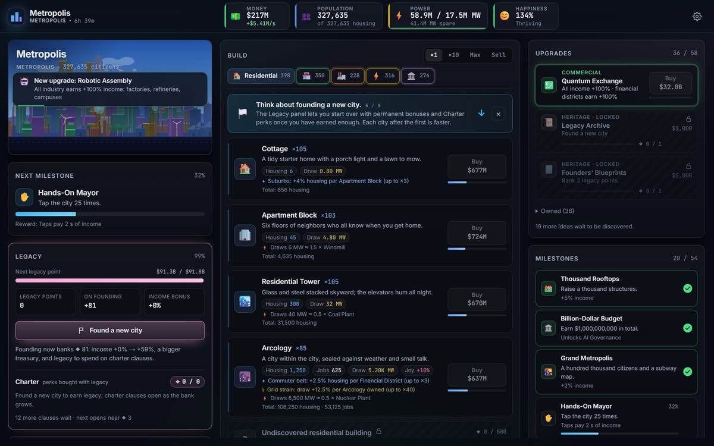
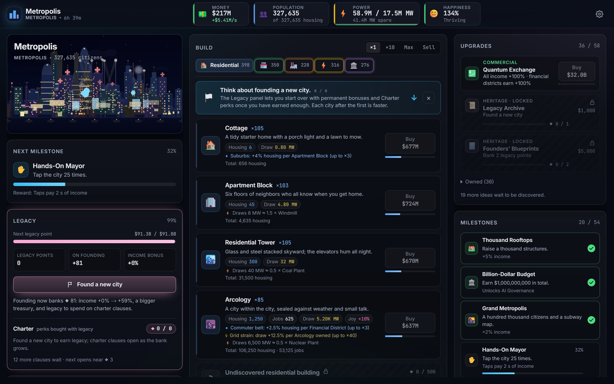

<p align="center">
  
</p>

<h1 align="center">Metropolis</h1>

<p align="center">
  <em>An idle city that draws its own skyline. Build it, power it, keep it happy, then found a better one.</em>
</p>

<p align="center">
  <a href="https://severalherr.itch.io/metropolis"></a>
  
  
</p>

---

**[Play it in the browser &rarr;](https://severalherr.itch.io/metropolis)**

A SimCity-flavoured incremental game. You are the mayor of a plot of land: build homes, put
citizens to work, keep the lights on, keep them happy, then found a new city and carry your
legacy forward. Plain HTML, CSS and ES modules — no build step, no framework, no dependencies at
runtime. The whole economy runs in Node as well as in the browser, which is how it is tuned.

<details>
<summary><strong>The prompt this repo was built from</strong> (Fable 5.1 experiment)</summary>

 # Goal
  Build a SimCity-inspired incremental/idle game in plain HTML/CSS and ES modules from this empty folder. The bar is a premium idle game: sleek UI, satisfying progression, clear resource management (money, population, power), and visual dashboard expansion. Never messy programmer art.

  # How to work
  1. Architecture first. Write ARCHITECTURE.md: one folder per subsystem (resources, buildings, upgrades, tick-simulation, UI, save-system), a shared game state, public APIs, and a performance budget (steady 60fps UI, stable tick loop). Isolate modules so a broken upgrade never crashes the main game.
  2. Build the verification loop. A headless-Chrome tool that loads the app, runs 10,000 simulated game ticks, and writes a JSON log (console errors, tick times, resource curves) plus a UI screenshot.
  3. Fan out. Use multi-agent orchestration. One builder agent per module. Run in dependency waves: (1) core state, tick loop, UI shell; (2) buildings, upgrades, resource math; (3) game balance. An integrator agent handles core changes and fixes seams between modules.
  4. Gauntlet every module. A critic agent checks UI screenshots, tick logs, and economy pacing, scoring 0–10 against top-tier incremental games (like Universal Paperclips or Cookie Clicker): 10 = flawless/addictive, 8.5 = great premium indie, 5 = programmer art/unbalanced. Pass = ≥8.5 with zero errors. Builders revise up to 4 times based on feedback.
  5. Final gate. An economy critic runs an accelerated end-game simulation to guarantee mathematical progression doesn't stall, bottleneck, or overflow.
  6. /loop until every critic passes. Persist scores and issues to docs/STATUS.json so each iteration resumes from the weakest module, not from scratch.

  # Rules
  - Never inflate scores. Report real numbers, failed rounds, and balance flaws.
  - Never edit another module's folder. Core changes go through the integrator.
  - Keep the dev server running and the app loadable at all times.
  - Do not ask me questions. Make routine game-balance decisions yourself, state assumptions, keep going.
  Start now.

</details>

## Screenshots

| | |
|---|---|
|  |  |
| **Minute zero.** A plot of land, $300 in the treasury, and a $30 cottage. | **Twenty-five minutes in.** Five categories of building, the grid holding, legacy 55&nbsp;% of the way to a new city. |
|  |  |
| **327,635 citizens.** Every building you own is drawn into the skyline. | **The same city at night.** The day/night cycle runs on its own eight-minute clock. |

## Run it

```sh
npm install                # puppeteer-core only (headless verification)
npm run serve              # static server on http://localhost:5173 — keep it running
```

Open http://localhost:5173. The city autosaves to `localStorage` every 30 s and catches up on
offline time when you return. `?headless=1` mounts the game without loading or writing a save.

## Check it

| Command | What it does |
|---|---|
| `npm test` | Runs every `src/*/*.test.mjs` and `tools/save-test.mjs`, each in its own process. |
| `npm run verify -- --ticks 10000 --tag gauntlet` | Headless Chrome (needs `npm run serve`): loads the app, plays 10,000 ticks with the greedy bot, samples tick cost and fps, writes `logs/gauntlet.json` and `logs/screenshot-gauntlet-*.png`. Fails on any console or page error. |
| `npm run sim -- --ticks 432000 --out logs/sim-gauntlet.json` | Node-only 12 game-hour economy sim with prestige loops. Prints `PASS/FAIL (contract PASS/FAIL)` and the per-city cycle times; the JSON carries the late-game contract metrics. |
| `npm run sim -- --ticks 432000 --saver --out logs/sim-saver.json` | The same session with a bot that saves toward a rung within 30 s of income (held to the hard gates only). |

Balance tooling lives beside the numbers: `node src/balance/probe.mjs` (cycle ratios, rung placement,
under-power by hour, `--first`, `--set`, `--boost`, `--unlock`, `--save N`), `node src/balance/place.mjs`
(re-prices the late ladder one rung per city), `node src/buildings/catalogue.mjs` (the shipped building
ladder) and `node src/buildings/cadence.mjs` (first-city unlock/first-buy timing).

## Layout

```
index.html            entry; loads src/main.js
src/
  main.js, boot.js    browser bootstrap / defensive loader shared with the Node tools
  core/               state, events, registry, tick loop, public api, formatting, safety, the bot
  balance/            every tuning number (config.js) + probe/place tooling + plan.json
  resources/          resource metadata and the derived-rate math (income, growth, power, happiness)
  buildings/          the 22-building catalogue, live synergy rules, unlock cadence
  upgrades/           70 upgrades: the core ladder, pace and frontier rungs, 12 legacy-priced charter perks
  simulation/         the tick: fold mods, integrate, milestones, prestige, dashboard gates
  ui/                 the DOM: topbar, skyline, build panel, upgrades, Legacy panel, log, toasts, settings
  save/               localStorage autosave, export/import, offline catch-up, migrations, recovery
tools/
  serve.mjs           dev server        verify.mjs   headless-Chrome gauntlet
  economy-sim.mjs     12 h economy sim  test.mjs     `npm test` runner     save-test.mjs  save scenarios
docs/
  DESIGN.md           game design, module contracts, the late-game contract and its measured numbers
  STATUS.json         critic scores and open issues per module
logs/                 tool output (git-ignored): gauntlet.json, sim-gauntlet.json, sim-saver.json, screenshots
```

`ARCHITECTURE.md` documents the shared state, the modifier bag, the registry and the public api.

## Module isolation

One folder per subsystem, one owner each. A builder edits only its own folder; `src/core/` and
every cross-folder seam go through the integrator. `core`, `balance`, `resources`, `buildings`,
`upgrades` and `simulation` are DOM-free and must import cleanly in Node — the economy sim runs
them directly. Only `ui` and `save` touch `window`, `document` or `localStorage`. Content modules
never write state; they register definitions, fold into a fresh modifier bag each tick, and every
registered callback is guarded so a broken definition is disabled after repeated failures while
the game keeps ticking.

## The critic gate

Every module is scored 0–10 against top-tier idle games by an independent critic; the record is
`docs/STATUS.json` (score, verdict and open issues per module, plus the economy and verify
results). A module passes at ≥ 8.5 with zero errors; builders get up to four revision rounds, then
the integrator resolves the cross-folder requests, re-runs the gauntlet and commits. Current
scores: core 9.0, resources 8.8, save 8.8, simulation 8.6, ui 8.6, balance 8.5, buildings 8.5,
upgrades 8.5 — all passing.

## Measured pacing

From `logs/sim-gauntlet.json` (`npm run sim -- --ticks 432000`, greedy bot, 2026-09-07):

- **PASS, contract PASS**, 0 issues, 0 errors, ~20k ticks/s.
- First founding at **41.1 min**; 34 foundings in 12 h. Cycles fall to a 6.5–7 min floor, then
  plateau at 20–43 min; every cycle from the 5th on is ≤ ×1.343 the previous (contract ≤ ×1.35);
  last cycle 18.1 min.
- Every building and all 70 upgrades bought; no city after the 4th passes without something new.
- The cheapest open upgrade sits 30 s – 15 min of income away in **41 %** of samples (contract ≥ 30 %).
- Under-power **3.4 %** of the session, floor 0.60 (contract 3–20 %); happiness dips below 100 %
  in 21 of 34 cities (contract ≥ 50 %).
- Legacy 530,718 (213,186 spent on all twelve charter perks); money peak 3.1e17, income 4.4e15/s.
- Saver profile (`logs/sim-saver.json`): PASS, contract PASS on the hard gates; 35 foundings,
  first at 38.1 min, reach 62 %, legacy 746,168, money peak 4.8e17, 9 late cities with nothing new
  (documented in `src/balance/config.js`, "What the saver brake is").

Verify (`logs/gauntlet.json`, 10,000 ticks in Chrome): 0 errors, 0 warnings, 60.4 fps, tick
0.012 ms average / 0.10 ms p99, no horizontal overflow.

## Deploy

Every push to `master` runs `.github/workflows/deploy-to-itchio.yml`: it assembles `index.html`
plus `src/` into `dist/` (no build step — the game is plain ES modules) and pushes that directory
to [`severalherr/metropolis:html5`](https://severalherr.itch.io/metropolis) with butler, stamped
with the short commit SHA. The credential check runs first, so a missing `BUTLER_API_KEY` fails in
seconds rather than at the upload.

## Status (2026-09-07 wrap-up)

Critic gate history and open items live in `docs/STATUS.json` (`modules`, `open`, `history`).
Last full gate: core 9.0, resources 8.8, ui 8.6, simulation 8.6, save 8.5 pass; buildings 8.2,
upgrades 8.0, balance 7.5 below the 8.5 bar (all with zero errors). Headless verify passes with
zero errors at 60 fps; the default-profile 12 h economy sim passes every contract metric; the
`--saver` profile still overshoots the magnitude gate. Mobile layout (< 900 px), sound effects and a six-step tutorial were added after the last gate and are not yet critic-scored. See `open` in STATUS.json for the short list.
